# Open World — prototype multijoueur 3D dans le navigateur

Un navigateur, un monde 3D partagé immense, des personnages qui marchent
ensemble. C'est tout — et c'est voulu : ce dépôt est la **fondation minimale**
sur laquelle d'autres fonctionnalités pourront être ajoutées.

- vrais modèles 3D **KayKit** (personnages Adventurers + Medieval Hexagon Pack, CC0)
- déplacement WASD/ZQSD, course, saut, caméra 3ᵉ personne à la souris
- collisions réelles (maisons, rochers, arbres, montagnes, lacs, rivières)
- **un seul monde** partagé par tous les joueurs, mêmes coordonnées globales
- monde déterministe généré par chunks et streamé autour du joueur → pas de limite pratique
- serveur **autoritaire** (Colyseus + Rapier) ; le client ne fait que prédire
- social : pseudo et choix du personnage à l'entrée, pseudos au-dessus des têtes, chat avec
  bulles, emotes animées, mini-carte avec les autres joueurs (même très loin), liste des joueurs
- **invocations** : une collection de créatures (vrais modèles animés Quaternius), 3 de départ,
  une invocation gratuite aléatoire par jour, une créature active qui suit et se bat
- **combat** autoritaire : ciblage, 4 capacités par créature (mêlée, projectile, zone, ruée,
  bonus), PV, temps de recharge, K.O. et réapparition
- **sauvegarde** : position globale, collection et amis gardés côté serveur (fichier JSON)
- **amis** : code FRIEND-XXXX, demandes, en ligne / hors ligne, **rejoindre un ami** (le serveur
  choisit la place)
- **lieux spéciaux** : sanctuaires, ruines, arènes, cimetières, points de rendez-vous
- **monture** : un cheval animé (G), deux fois plus rapide, synchronisé et prédit
- **aucun argent réel, aucun paiement, aucune monétisation**

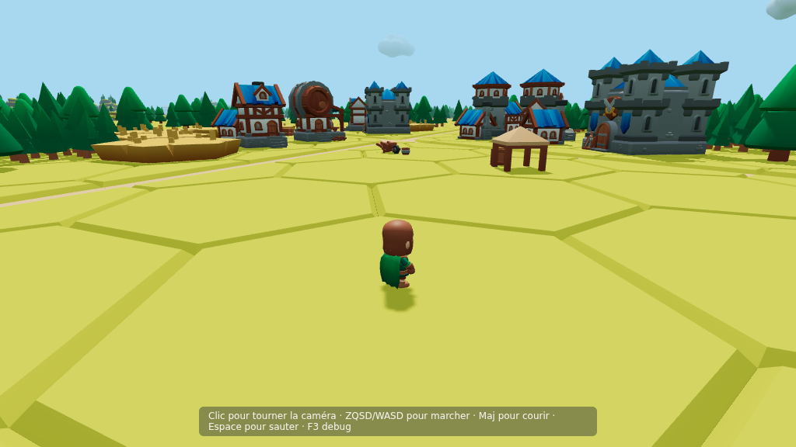

| | |
|---|---|
| 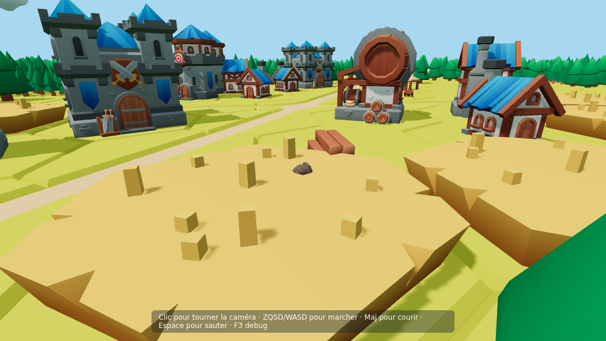 | 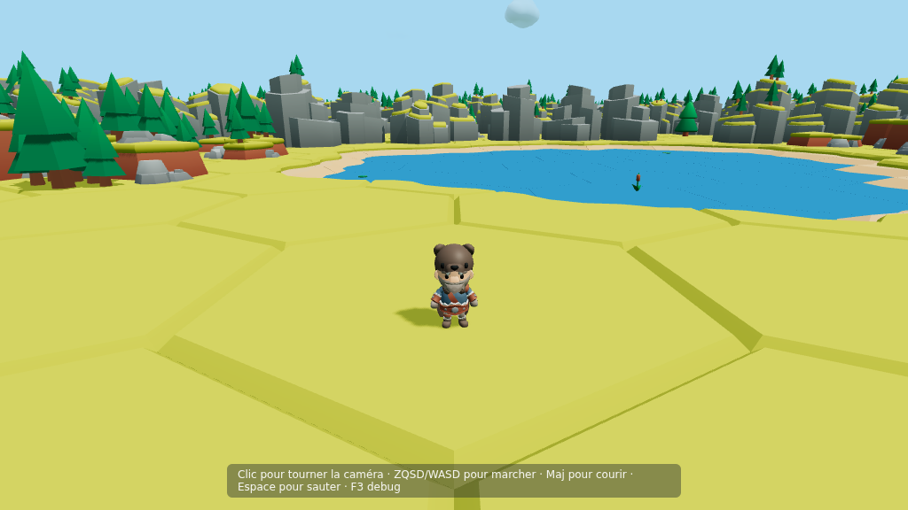 |
| 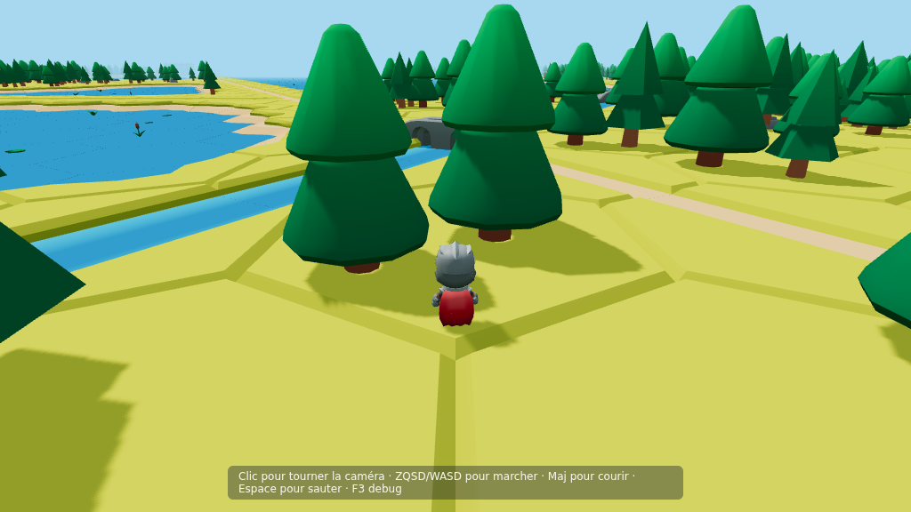 | 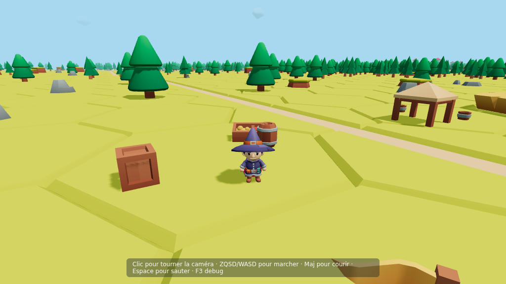 |
| 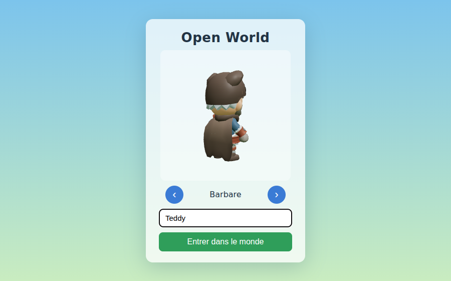 | 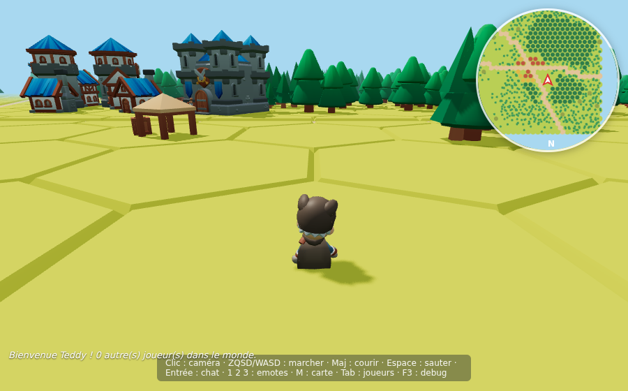 |
| 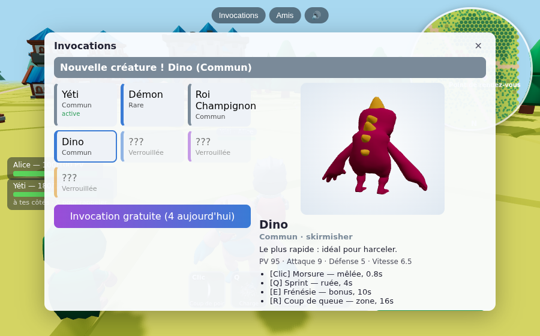 | 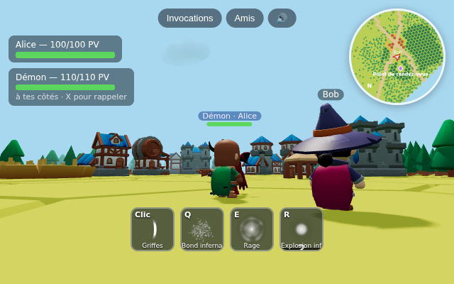 |
| 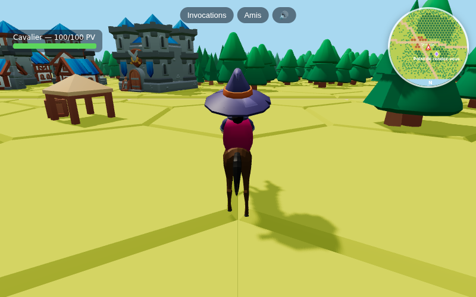 | 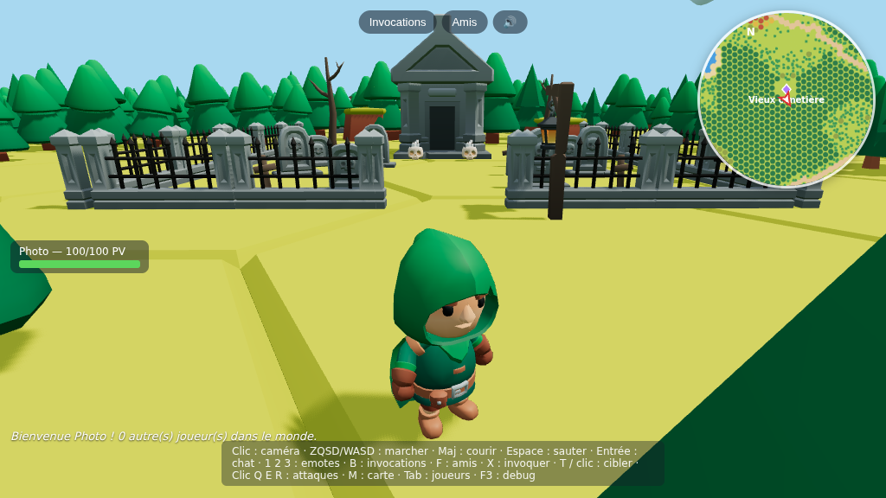 |
| 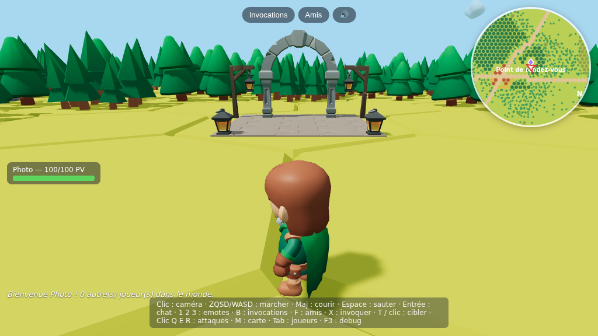 | |

*Captures faites en Chromium headless (rendu logiciel) par `scripts/tour-screenshots.mjs`.*

## Démarrage rapide

Prérequis : **Node.js ≥ 20.6** (testé avec Node 22) et npm.

```bash
npm install
npm run dev
```

`npm run dev` lance en parallèle :

| service | adresse |
|---|---|
| client (Vite) | <http://localhost:5173> |
| serveur de jeu (Colyseus) | `ws://localhost:2567` |

Ouvre <http://localhost:5173> : tu apparais près du point (0, 0).

### Tester à deux joueurs

1. `npm run dev`
2. ouvre <http://localhost:5173> dans une fenêtre A ;
3. ouvre la même adresse dans une fenêtre B (autre fenêtre, onglet privé ou autre navigateur) ;
4. les deux personnages apparaissent côte à côte (à 3 m d'écart), chacun voit l'autre bouger.

Sur un réseau local, les amis ouvrent `http://<ip-de-ta-machine>:5173` (le
client se connecte automatiquement au serveur sur la même machine, port 2567).

### Contrôles

| touche | action |
|---|---|
| W A S D (ou Z Q S D en AZERTY, ou flèches) | marcher (relatif à la caméra) |
| Maj | courir |
| Espace | sauter |
| clic puis souris (ou glisser) | tourner la caméra |
| molette | zoom |
| Entrée | ouvrir le chat / envoyer (Échap pour annuler) |
| 1 / 2 / 3 | emote : applaudir / s'asseoir / s'allonger (même touche = arrêter, bouger = arrêter) |
| B | collection d'invocations (choisir la créature active, invocation gratuite) |
| X | invoquer / rappeler la créature active |
| T ou clic sur un joueur / une créature | choisir une cible |
| clic (caméra verrouillée) / Q / E / R | capacités de la créature : attaque de base, puis 3 capacités |
| G | monter sur le cheval / en descendre |
| F | amis : ton code, ajouter, accepter, REJOINDRE |
| M | afficher / masquer la mini-carte |
| Tab (maintenu) | liste des joueurs avec distance et direction |
| F3 | panneau de debug discret (ou `?debug` dans l'URL) |

À l'arrivée, un écran demande un pseudo et le personnage (aperçu 3D) ; le choix est
mémorisé dans le navigateur. La mini-carte tourne avec la caméra (le haut = où tu regardes) ;
les joueurs hors de portée apparaissent en flèches sur le bord avec leur distance.

### Fonctionnalités de jeu

- **Invocations** — chaque créature est un fichier JSON (`shared/src/data/summons/`) : modèle,
  statistiques, 4 capacités, animations. Le moteur de capacités est générique (types
  `melee`, `projectile`, `aoe`, `dash`, `buff`) : ajouter une créature = un modèle + un JSON.
  La créature active suit son joueur (états IDLE / FOLLOW / ATTACK / RETURN / DEAD), arrive
  avec un effet de portail et un son. Une seule active par joueur. Invocation gratuite :
  5 par jour, rareté tirée côté serveur (commun / rare / épique / légendaire).
- **Combat** — le client envoie seulement « j'utilise la capacité n° i » et « je vise X » ; le
  serveur vérifie la capacité, la propriété, la portée, la cible, le temps de recharge, puis
  calcule les dégâts. À 0 PV : K.O. 4 s puis réapparition au spawn.
- **Sauvegarde** — un identifiant stable est créé dans le navigateur (`localStorage`) ; le serveur
  garde position globale (x, y, z + orientation), créatures, amis dans `server/data/players.json`
  (écriture atomique, toutes les 5 s et à la déconnexion). Positions invalides ignorées. Pas de
  compte ni de mot de passe : c'est volontairement une identité légère.
- **Amis** — chaque joueur a un code `FRIEND-XXXX`. « Rejoindre » envoie `JOIN_FRIEND(code)` :
  le serveur vérifie l'amitié, la présence en ligne, l'anti-spam (10 s), puis place le joueur à
  3 m de son ami. Le client n'envoie jamais de coordonnées ; la position d'un ami hors ligne
  n'est jamais transmise.
- **Lieux spéciaux** — dispositions décrites en JSON (`shared/src/data/poi/`) avec les modèles
  KayKit Dungeon / Halloween ; au plus un lieu par case de 384 m, placé de façon déterministe sur
  du terrain dégagé ; un point de rendez-vous près du spawn. Repères sur la mini-carte et
  bandeau « Lieu découvert » en entrant.
- **Monture** — `shared/src/data/mounts/horse.json` : marche 7 m/s, galop 14 m/s. Le serveur
  valide la demande (vivant, pas en plein saut, 1 s entre deux demandes) ; la vitesse est
  appliquée par le même code de simulation côté client et serveur, donc la prédiction reste
  exacte. Le joueur garde sa capsule de collision simple.

### Paramètres d'URL

| paramètre | effet |
|---|---|
| `?debug` | affiche le panneau de debug dès le départ (sinon F3) |
| `?radius=2` | distance de vue en chunks de 128 m (1 à 5, défaut 3) — baisser sur une machine modeste |
| `?server=ws://hote:2567` | serveur de jeu à utiliser (par défaut : même machine, port 2567) |
| `?name=Teddy&character=2` | entre directement avec ce pseudo / personnage (0–4), sans l'écran d'accueil |

### Production (un seul processus)

```bash
npm run build      # construit le client dans client/dist
npm start          # serveur Colyseus sur :2567, qui sert aussi client/dist
```

puis ouvre <http://localhost:2567>. Variable `PORT` pour changer le port.

## Tests

```bash
npm test                                   # tests unitaires/intégration (Node)
npm run typecheck                          # TypeScript sur les 3 paquets
# avec `npm run dev` lancé, tests dans de vrais navigateurs (Chromium headless via Playwright) :
node scripts/two-players-test.mjs          # 2 fenêtres : se voient, bougent, déconnexions
node scripts/collision-test.mjs            # foncer dans une maison puis un rocher
node scripts/error-test.mjs                # serveur absent, WebGL absent, asset manquant, connexion coupée
node scripts/save-test.mjs                 # recharger la page = même position, même pseudo
node scripts/summon-test.mjs               # invocation vue par les deux joueurs, suivi, panneau, invocation gratuite
node scripts/combat-test.mjs               # ciblage, capacités, dégâts vus des deux côtés, K.O., réapparition
node scripts/friends-test.mjs              # code ami, demande, acceptation, en ligne, REJOINDRE, sauvegarde, hors ligne
node scripts/mount-test.mjs                # monter, galoper (vitesse, prédiction), vu par l'autre joueur, descendre
npx tsx scripts/load-test.ts 10 60         # 10 joueurs-robots (déplacements, invocations, combats, monture) pendant 60 s
node scripts/tour-screenshots.mjs docs     # captures de quelques lieux (lance son propre serveur sur :2601)
```

Résultat du test de charge (10 robots, 60 s, machine de build) : tick serveur moyen ≈ 1,1 ms
pour un budget de 33 ms (pics ≈ 50 ms quand des chunks de collision sont générés), 20 mises à
jour d'état/s et ≈ 9 Kio/s reçus par client. `GET /stats` expose ces mesures.

Les tests navigateur utilisent Chromium headless avec rendu logiciel (lent mais
sans GPU) et `?radius=1|2` pour aller plus vite.

| test demandé | où |
|---|---|
| A — une fenêtre, personnage visible + déplacement | `two-players-test.mjs`, captures `docs/` |
| B — collision obstacle (maison, rocher) | `collision-test.mjs` (navigateur), `shared/test/world.test.ts` |
| C — deux fenêtres visibles | `two-players-test.mjs` |
| D — A voit B bouger (et inversement) | `two-players-test.mjs`, `server/test/room.test.ts` |
| E — déconnexion (onglet fermé / connexion coupée) | `two-players-test.mjs`, `server/test/room.test.ts` |
| F — chunks apparaissent / disparaissent | `client/test/streaming.test.ts` |
| G — déterminisme | `shared/test/world.test.ts`, `client/test/streaming.test.ts` |
| H — grande distance (bot qui court ~2 km en contournant les obstacles, coordonnées à 12,5 km et 1 000 km, passage de frontière de région) | `server/test/longdistance.test.ts`, `tour-screenshots.mjs far` |
| I — retour au même endroit = même environnement | `client/test/streaming.test.ts` |
| gestion d'erreurs (§44) | `error-test.mjs` |
| deux joueurs voient les invocations | `summon-test.mjs`, `server/test/summons.test.ts` |
| combat (dégâts, recharge, K.O., réapparition, requêtes invalides) | `combat-test.mjs`, `server/test/combat.test.ts` |
| sauvegarde / reconnexion / données invalides | `save-test.mjs`, `server/test/persistence.test.ts` |
| amis + rejoindre (sécurité côté serveur) | `friends-test.mjs`, `server/test/friends.test.ts` |
| monture | `mount-test.mjs`, `server/test/mount.test.ts` |
| lieux spéciaux (déterminisme, terrain dégagé, colliders) | `shared/test/poi.test.ts`, `tour-screenshots.mjs poi-*` |
| performance 10 joueurs | `scripts/load-test.ts` |

Le serveur accepte `DEBUG_SPAWN="x,z"` (tests uniquement) pour faire
apparaître les joueurs ailleurs, par ex. `DEBUG_SPAWN=12500,-8300 npm run dev`.

## Architecture

```
shared/            code commun client + serveur (aucune dépendance au rendu ni au réseau)
  src/constants.ts       seed du monde, tailles, vitesses, tick
  src/world/             grille hexagonale, bruit/hash déterministes, routes & rivières,
                         choix des tuiles, génération de chunk, catalogue de colliders
  src/physics/           PhysicsWorld : monde Rapier + character controller
  src/sim/movement.ts    un pas de simulation d'un personnage (serveur ET prédiction client)
  src/protocol.ts        messages, liste des personnages, règles de combat
  src/data/              données : summons/*.json, poi/*.json, mounts/*.json, créatures de départ
  src/summons/           registre des créatures (lecture des JSON, tirage par rareté)
  src/mounts/            registre des montures
  src/world/poi.ts       placement déterministe des lieux spéciaux
server/
  src/index.ts           serveur Colyseus (+ fichiers statiques en production)
  src/rooms/WorldRoom.ts LA room unique du monde partagé
  src/rooms/schema.ts    état synchronisé minimal (x, y, z, yaw, anim, personnage…)
  src/simulation/        simulation autoritaire (régions physiques, chunks de collision)
  src/summons/           créatures actives : IA, déplacement, invocation / rappel / tirage
  src/combat/            AbilitySystem (générique par type) + CombatSystem (PV, cibles, K.O.)
  src/friends/           codes ami, demandes, statut, rejoindre un ami
  src/persistence/       PlayerData, JsonPlayerStore (fichier JSON), PlayerDataService
client/
  src/main.ts            démarrage + erreurs
  src/game/Game.ts       boucle, scène, branchements ; ui.ts = statut/erreurs/debug
  src/game/EntryScreen.ts  écran pseudo + personnage ; social.ts = étiquettes, chat, liste des joueurs
  src/assets/            chargement + cache des glTF KayKit
  src/world/             WorldManager (streaming des chunks), EnvironmentRenderer (instancing), Minimap
  src/player/            PlayerController (local), RemotePlayer, CharacterModel, Input
  src/camera/            caméra 3ᵉ personne avec anti-traversée des murs
  src/networking/        NetworkManager : seul fichier qui parle à Colyseus
  src/summons/           rendu des créatures (modèle animé, interpolation)
  src/combat/            ciblage, retours visuels / sonores des dégâts
  src/mounts/            modèle du cheval sous le cavalier
  src/poi/               bandeau « Lieu découvert »
  src/ui/                panneaux Invocations / Amis, barre de capacités, aperçu 3D
  src/vfx/ src/audio/    effets (sprites Kenney) et sons (CC0)
  inspect.html           outil d'inspection des modèles (dev)
scripts/                 fetch/prepare des assets, tests navigateur
```

### Inspection des assets

```bash
node scripts/inspect-assets.mjs Knight     # bornes, animations, triangles, textures d'un modèle
```

et <http://localhost:5173/inspect.html?set=roads> (aussi `rivers`, `coast`, `nature`,
`buildings`, `characters`) pour voir les modèles et les numéros d'arêtes des tuiles.

### Le monde

- **Coordonnées globales** en mètres (doubles JS). Le serveur et tous les clients utilisent les mêmes.
- **Chunks** de 128 m identifiés par `(chunkX, chunkZ)`. `generateChunk(cx, cz)` ne dépend que de
  `WORLD_SEED = "friends-world-001"` et des coordonnées → même chunk, même contenu, pour tout le monde,
  à chaque fois (hash entiers + bruit à base d'opérations IEEE exactes, aucun `Math.random`).
- Le sol est une grille de tuiles hexagonales KayKit (12 m). Les grands éléments sont des
  fonctions des **coordonnées monde** (pas du chunk), donc continus d'un chunk à l'autre :
  - routes : deux familles de lignes infinies légèrement sinueuses (tous les ~350 m), avec
    carrefours et villages aux croisements ;
  - rivières : une famille de lignes (tous les ~650 m), avec pont aux croisements avec les routes ;
  - lacs (avec côtes), forêts, collines et montagnes par bruit basse fréquence.
- **Streaming** (client) : chunks dans un rayon de 3 chargés (≈ 900 m de côté), libérés au-delà de 4.
  Un chunk n'apparaît qu'une fois tous ses modèles chargés ; le brouillard cache la frontière.
  Les modèles ne sont téléchargés qu'à leur première utilisation puis mis en cache.
- **Rendu** : un `InstancedMesh` par (modèle, bloc de 2×2 chunks), un seul matériau (l'atlas KayKit).
- **Floating origin** : le rendu est recentré autour du joueur tous les 1 024 m ; les coordonnées
  réseau ne changent jamais.

### Physique & réseau

- Visuel = modèle KayKit ; physique = **capsule Rapier** (1,8 m) + character controller
  (gravité, glisse le long des murs, petites marches, pentes ≤ 50°).
- Décor : colliders simples (boîte pour les maisons et champs, cylindre pour les troncs, enveloppe
  convexe réduite pour rochers/collines/montagnes/ponts, prisme hexagonal pour l'eau, dalle par chunk
  pour le sol). Les houppiers ont un collider « caméra seulement » pour que la caméra n'entre pas
  dans le feuillage.
- Le client envoie **uniquement des intentions** (direction, course, saut) à 30 Hz. Le serveur
  simule (même code `stepCharacter`), et diffuse l'état à 20 Hz. Il limite le débit d'inputs
  (pas d'accélération par flood).
- Le client **prédit** son propre mouvement avec le même code puis se **réconcilie** sur l'état
  serveur (rejeu des inputs non acquittés). Les mondes Rapier client et serveur ont la même origine
  (grille de régions de 4 096 m) → prédiction identique au serveur (0 correction en marche,
  au plus ~1 mm occasionnellement en sautant, lissé à l'affichage).
- Les autres joueurs sont **interpolés** 120 ms dans le passé.
- Une seule `WorldRoom` ; tout le monde y entre. Pour plus tard : filtrer par proximité
  (StateView Colyseus + grille de chunks) sans toucher à la simulation.

## Assets & licences

Voir [ASSETS.md](ASSETS.md) : sources officielles, licences (CC0), fichiers utilisés, date.
Les fichiers préparés sont versionnés dans `client/public/assets/`. Pour les régénérer :

```bash
./scripts/fetch-assets.sh        # clone les dépôts officiels KayKit (commits épinglés) dans .asset-cache/
npm run assets:prepare           # copie / allège les modèles, recalcule les bornes de collision
```

## Choix techniques (recherche d'octobre 2026)

| besoin | choix | pourquoi |
|---|---|---|
| rendu | three.js 0.186 + WebGL2, Vite 8, TypeScript | marche partout sans config, GLTFLoader mature ; WebGPU possible plus tard |
| physique | @dimforge/rapier3d-compat 0.21 | même WASM en Node et navigateur (déterministe), character controller intégré |
| réseau | Colyseus 0.18 (+ @colyseus/sdk) | rooms autoritaires, état binaire delta, reconnexion automatique |
| assets | KayKit Adventurers + Medieval Hexagon (CC0) | récupérables de façon reproductible via le GitHub officiel KayKit |

Forest Nature Pack et Character Animations ne sont publiés que sur itch.io, bloqué par
l'environnement de build ; ils ne sont pas nécessaires au prototype (voir ASSETS.md).

## Limites connues / prochaines étapes possibles

- Les joueurs ne se bloquent pas entre eux (fantômes), volontairement.
- Les rivières et lacs sont infranchissables à la nage ; on traverse par les ponts des routes.
- Pas de filtrage par zone d'intérêt (inutile pour 10–20 joueurs).
- Chat sans modération ni historique (simple diffusion, anti-spam ~1,5 message/s, 140 caractères).
- Identité légère (identifiant dans le navigateur, pas de compte) : vider les données du site
  = repartir de zéro. Ouvrir un 2ᵉ onglet donne un 2ᵉ joueur (identifiant de session).
- Sauvegarde dans un simple fichier JSON (`DATA_DIR`), suffisant pour un petit groupe d'amis.
- Les combats sont ouverts partout (pas de zone protégée) ; les créatures n'attaquent que sur ordre de leur joueur (ou pour riposter).
- Le cavalier garde la capsule d'un piéton (collision simple, voulu).
